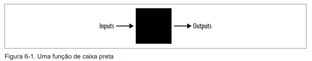

# Introdução a Linguagem Go

Repositório dedicado a leitura do Livro [_Introducing Go_](https://www.amazon.com.br/Introducing-Go-Caleb-Doxsey/dp/1491941952) do autor Caleb Doxsey.
O autor aborda os principais recursos da linguagem e também tem os exercícios de cada capítulo para ajuda-lo a praticar o que aprendeu.

## Capítulo 1 - Introdução

> Package main
> - É uma declaração de pacote e todo programa Go deve começar com ela.
> - Os pacotes são a maneira do Go organizar e reutilizar os códigos.
> - Existem dois tipos de programas em Go: Executáveis e bibliotecas. Executáveis são is tips de programas que podemos executar diretamente do terminal e Bibliotecas são coleções de código que empacotamos para que possamos usá-los em outros programas. 
>
> 
> Import "fmt"
> - O import é como incluímos código de outros pacotes para usar com o nosso programa.
> - O "fmt" (abreviação de formato) implementa a formatação de entrada e saída.
> - Para comentários -> // e /**/.
> - Funções são os blocos de construção de um programa Go. Eles têm entrada, saídas e uma série de etapas chamadas de instruções que são executadas em ordem. Todas as instruções devem começar com "func" e em seguida com o nome da função (principal, neste caso), uma lista de zero ou mais parâmetros entre parênteses, um tipo de retorno opcional e um corpo cercado por chaves.

## Capítulo 2 - Tipos
> Números
> - Inteiros: São números sem componentes decimais. (...,0,1, 2, ...). Existem também três tipos inteiros dependentes da 
máquina: uint, int e uintptr. Eles dependem da máquina porque seu tamanho depende 
do tipo de arquitetura que você está usando.
>
> - Floats: Contém um componente decimal.
> 
> - String: Sequência de caracteres com comprimeito definido usadas para representar texto. As strings Go são compostas de bytes individuais, geralmente um para cada caractere.
>
> - Um espaço também é considerado um caractere.
>
> - Strings são indexadas começando em 0, não em 1.
>
> - A concatenação utiliza o mesmo símbolo da adição. Ex: Se ambos os lados forem strings, então o compiçador assume que você quer dizer concatenação e não adição.
>
> - O comprimento de uma string pode ser encontrado usando a função len (len("a string")).
>
> - Booleanos: Um valor booleano (em homenagem a George Boole) é um tipo inteiro especial de 1 bit usado para representar verdadeiro e falso. Existem três operadores lógicos principais: AND (&&), OR (||) e NOT (!).
>
> - Frequentemente os booleanos são usados para tomada de decisão.

## Capítulo 3 - Variáveis
>
> - Uma variável é um local de armazenamento, como um tipo específico e um nome associado.
>
> - O compilador não se importa com o nome que você da a uma variável,mas é importante escolher um nome que descreve claramente o propósito da variável.
>
> - camelCase é um estilo para escrever palavras compostas em que a primeira letra de cada nova palavra ou frase é maiúscula.
>
> - Duas formas de criar variáveis: var x = 5 ou x := 5.
>
> - Escopo é o intervalo de lugares em que uma variável pode ser usada. Ele é determinado lexicamente usando blocos.
>
> Constantes:
> - São variáveis cujo os valores não podem ser alterados posteriormente. Elas criadas da mesma forma que as variáveis, mas em vez de usar a palavra-chave var, usamos a palavra-chave const.

## Capítulo 4 - Estrutura de Controle
>
> - A instrução for nos permite repetir uma lista de instruções (um bloco) várias vezes.
>
> - Go só tem uma maneira de escrever loop, mas essa pode ser usada de várias maneiras.
>
> - Uma instrução if é semelhante a uma instrução for porque possui uma condição seguida por um bloco. As 
instruções if também têm uma parte else opcional. Se a condição for avaliada como verdadeira, o bloco após 
a condição será executado; caso contrário, o bloco será ignorado ou, se o bloco else estiver presente, esse 
bloco será executado.

## Capítulo 5 - Arrays, Slices, e Maps
>
> - Um array é uma sequência numerada de elementos de um único tipo com comprimento fixo.
> 
> - O compilador Go não permitirá que você crie variáveis que você nunca use.
>
> - Sublinhado (_) é usado para informar ao compilador que não precisamos disso (nesse caso, não 
precisamos da variável iteradora).
>
> - Slices é um segmento de um Array. Assim como os arrays, os slices são indexáveis e possuem um comprimento. Ao contrário dos arrays, esse comprimento pode mudar.
>
> Append:
> - Adiciona elementos ao final de um slices. Se houver capacidade suficiente no array, o elemento será colocado após o último elemento e o comprimeito será incrementado. Porém, se não houver capacidade suficiente, um novo array é criado, todos os elementos existentes são copiados, o novo elemento é adicionado ao final e o novo slice é retornado.
> 
> Copy:
> - Leva dois argumentos: dst e src. Todas as entradas em src são copiadas para dst, substituindo o que estiver lá. Se os comprimentos das duas fatias não forem iguais, será usada a menor das duas.
>
> - Maps são coleções não ordenada de pares de valores-chave. São usados para procurar um valor pela sua chave associada.
>
## Capítulo 6 - Funções
> - É uma seção independente de código que mapeia zero ou mais parâmetros de entrada para zero ou mais parâmetros de saída.
> 
>
> - As funções começam com a palavra-chave func, seguida do nome da função. Os parâmetros (entradas) da função são definidos: tipo de nome, tipo de nome... A função tem um parâmetro (a lista de pontuações) que chamamos de xs. Após os parâmetros. Colocamos o tipo retorno. Parâmentros e retornos são conhecidos como assiantura da função.
>
> - O corpo da função é uma série de instruções entre chaves.
>
> - Função panic causa um erro de execução.
>
> - As funções não têm acesso a nada na função de chamada, a menos que seja transmitida explicitamente.
>
> Defer:
> - Agenda uma chamada de função para ser executada após a conclusão da função.
>
> - Defer é frequentemente usado quando os recursos precisam ser liberados de alguma forma. Por exemplo, abrimos um arquivo, precisamos fechá-lo mais tarde.
>
> Panic:
> - Um panic geralemente indica um erro do programador (por exemplo, tentar acessar um índice de um array que está fora dos limites, esquecer de inicializar um map, etc) ou uma condição excepcional da qual não há uma maneira fácil de se recuperar.
>
> Ponteiro:
> - Fazem uma referência a um local na memória onde um valor é armazenado, em vez do valor em si. Usando um ponteiro (*int), a função zero é capaz de modificar a variável original.
>
<<<<<<< HEAD
## Capítulo 7 - Estruturas e Interfaces
> - Uma struct é um tipo que contém campos nomeados.
>
> - Interface usa a palavra chave type, seguida por um nome e a palavra chave interface. Mas em vez de definir campo, definimos um conjunto de métodos. Um conjunto de métodos é uma lista de métodos que um tipo deve ter para implementar a interface.
>
## Capítulo 8 - Pacotes
> Go foi projetado para ser uma linguagem que incentiva boas práticas de engenharia de software. Uma parte importante do software de alta qualidade é a reutilização do código.
>
> fmt é o nome de um pacote que inclui uma variedade de funções relacionadas à formatação e saída para a tela. Agrupar o código dessa forma serve a três propósitos:
>
> - Reduz a chance de termos nomes sobrepostos e, por sua vez, mantém nossa função nomes de ações curtos e sucintos.
>
> - Ele organiza o código para que seja mais fácil encontrar o código que você deseja reutilizar.
>
> - Ele acelera o compilador exigindo apenas a recompilação de partes menores de um programa. Embora utilizemos o pacote fmt, não precisamos recompila-lo toda vez que alteramos nosso programa.
>
> - Uma função hash pega um conjunto de dados e o reduz a um tamanho fixo menor. Hashes são frequentemente usados em programação para tudo, desde procurar dados até detectar facilmente alterações. As funções hash em Go são divididas em duas categorias: criptográficas e não criptográficas.
=======
>
>>>>>>> 8539ca545efcc87b366905523beef698ef6bc5a1
